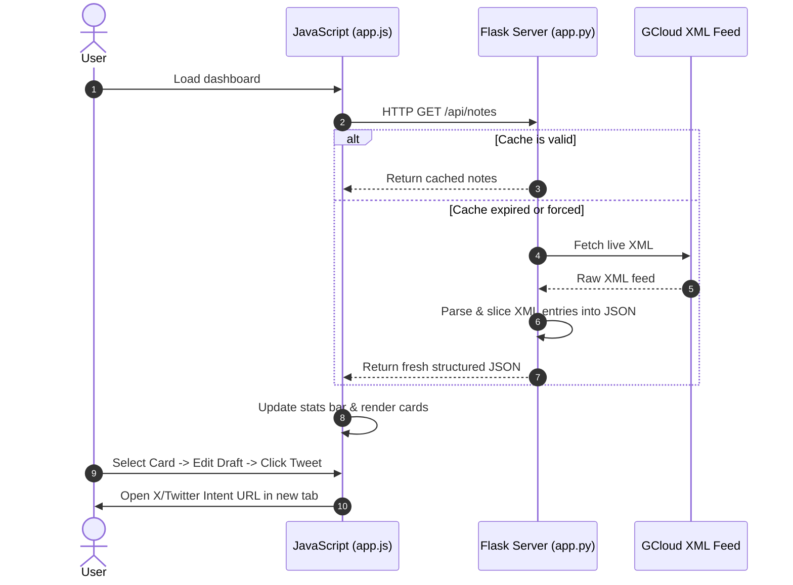

# BigQuery Release Notes Hub & Tweet Composer

A premium, modern web dashboard built with **Python Flask** and plain **HTML, JavaScript, and CSS** that aggregates live BigQuery Release Notes. It structures updates, offers rich search/filtering, and features a built-in X/Twitter Composer tool to easily share cloud updates with custom character limit tracking and smart pruning tools.

---

## ✨ Features

- **Automated Feed Parsing**: Ingests Google Cloud's official Atom XML feed, dynamically extracting and isolating individual release notes grouped under headings (Features, Announcements, Issues, Deprecations).
- **In-Memory Caching**: Implements a lightweight 5-minute memory cache to ensure fast page loads and avoid excessive feed requests, supporting manual force-refreshes.
- **Glassmorphic Aesthetic UI**: Premium dashboard design built with styled dark-mode card panels, custom scrollbars, and neon glows.
- **Live Search & Filter Chips**: Filter updates instantly by type (e.g. Features, Announcements, Issues) or by search query matching keywords, dates, or details.
- **Integrated Twitter/X Composer**:
  - Automatically compiles short templates: `BigQuery #[Type] Update (Date): "[Summary]" Docs: [Link]`.
  - Dynamic character progress wheel (circular SVG path changing color as you approach or exceed 280 characters).
  - Composer tools: **Shorten** (smart paragraph pruning), **Hashtags Toggle** (appends `#BigQuery #GoogleCloud #GCP`), and **Reset** (restores default draft template).
  - Click to publish using Twitter Web Intents opening directly in a safe popup container.

---

## 📂 Project Structure

```
bq-releases-notes/
├── app.py                  # Flask web backend (caching, routing, XML/HTML parser)
├── requirements.txt        # Python package dependencies
├── README.md               # Project documentation
├── .gitignore              # Git ignore rules for build and editor cache
├── templates/
│   └── index.html          # HTML single page structure & SVG progress elements
└── static/
    ├── css/
    │   └── style.css       # Core styling, animations, colors, and layout
    └── js/
        └── app.js          # Main client-side state machine, metrics, and Composer logic
```

---

## 🛠️ Quick Start

Follow these steps to run the application locally:

### Prerequisites
- Python 3.8+ installed on your system.

### 1. Set Up Virtual Environment
Initialize a Python virtual environment and activate it:
```bash
# Create venv
python3 -m venv .venv

# Activate venv (macOS/Linux)
source .venv/bin/activate

# Activate venv (Windows)
.venv\Scripts\activate
```

### 2. Install Dependencies
Install the required packages:
```bash
pip install -r requirements.txt
```

### 3. Run the Flask Server
Start the development server:
```bash
python app.py
```
By default, the application runs in debug mode on **[http://127.0.0.1:5001](http://127.0.0.1:5001)**.

---

## 🔄 How It Works (Data & Share Flows)


